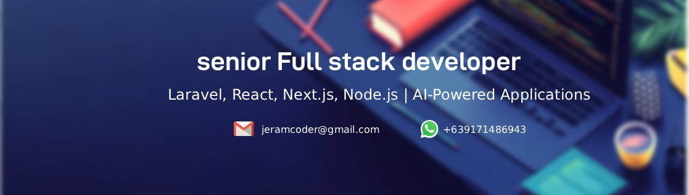

  

  

  

  ### About Me

  Senior full-stack developer with 10+ years of experience building scalable web and mobile applications for startups and product teams across the US and Europe. I handle projects end-to-end — architecture, backend, frontend, DevOps, and deployment. I’ve worked fully remote for 6+ years across multiple time zones. I also build AI-powered features using OpenAI, LangChain, and modern backend systems.

<h2 align="center">
  
  Technical Skills
</h2>

  <table>
    <thead>
      <tr>
        <th>Frontend</th>
        <th>Backend</th>
        <th>Mobile</th>
      </tr>
    </thead>
    <tbody>
      <tr>
        <td align="center">
          
        </td>
        <td align="center">
          
        </td>
        <td align="center">
          
        </td>
      </tr>
    </tbody>
  </table>

  <table>
    <thead>
      <tr>
        <th>Databases</th>
        <th>Cloud & DevOps</th>
        <th>AI</th>
      </tr>
    </thead>
    <tbody>
      <tr>
        <td align="center">
          
        </td>
        <td align="center">
          
        </td>
        <td align="center">
          
          
          
        </td>
      </tr>
    </tbody>
  </table>

  <table>
    <thead>
      <tr>
        <th>Payments & CMS</th>
        <th>Testing & Tools</th>
      </tr>
    </thead>
    <tbody>
      <tr>
        <td align="center">
          
          
          
          
          
          
        </td>
        <td align="center">
          
           
          
          
          
        </td>
      </tr>
    </tbody>
  </table>

